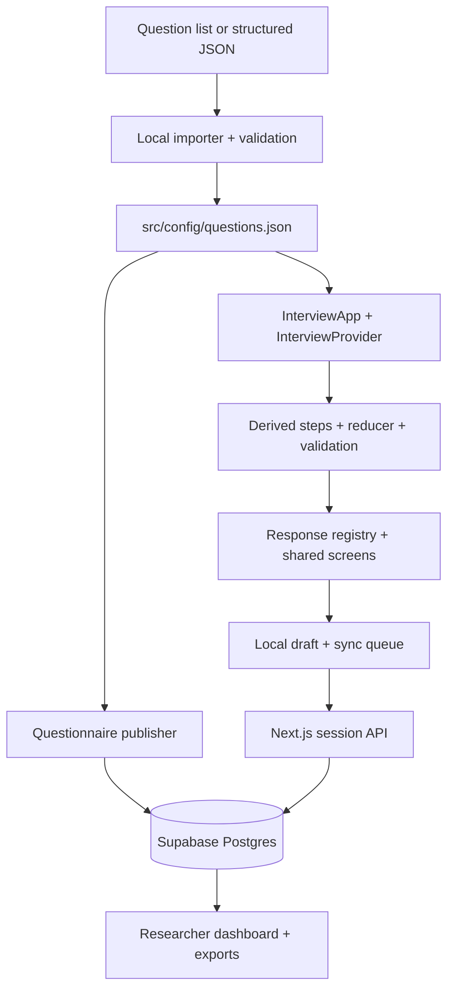

# Interview form: repository understanding and reuse

This guide describes the code inspected in this workspace and the workflow for
turning a supplied question set into a form. The main application is
`interview-form/`. The adjacent `thesis-interview-form/` has a smaller version of
the same frontend and local persistence, without the Supabase session API,
researcher dashboard, publishing scripts or database migrations. Work on the
main application unless a task explicitly targets the other copy.

## What the application does

This is a research interview application with two collection modes. A participant
can answer asynchronously without an account, or a signed-in researcher can enter
answers during a live interview. Both use the same questionnaire schema and
question components. The researcher can review sessions, add notes, inspect
answers by research construct, examine pilot completion statistics and export data.

The participant flow is welcome → consent → section introductions and questions
→ review/edit → submit → confirmation with a participant code. An unfinished
interview can be resumed, including on another device through a resume link.

## Technology and its role

Versions below are from this repository's package manifest, not a recommendation
to upgrade dependencies.

| Technology                     | Use in this application                                                                                             |
| ------------------------------ | ------------------------------------------------------------------------------------------------------------------- |
| Next.js 16.3.4, App Router     | Pages, layouts, server-rendered admin views, HTTP route handlers, production bundling with Turbopack                |
| React 19.2.8                   | Interactive question screens, context, hooks, reducer-driven interview state                                        |
| TypeScript 5, strict mode      | Question and response unions, component contracts, typed database access                                            |
| Tailwind CSS 4                 | Responsive layouts and utilities; shared colors, spacing, typography and dark-theme tokens in `src/app/globals.css` |
| shadcn/ui and Base UI          | Local UI components under `src/components/ui`; accessible input, checkbox, radio and other interaction primitives   |
| class-variance-authority, cn   | Component variants and class composition                                                                            |
| Motion 13                      | Screen transitions, progress and completion graphics; shared animation settings in `src/lib/motion.ts`              |
| Lucide React                   | Icons                                                                                                               |
| next-themes                    | System/light/dark theme handling                                                                                    |
| next/font                      | Geist, Geist Mono and Source Serif 4; serif headings and sans-serif interface text                                  |
| Zod 4                          | Runtime questionnaire checks and API request schemas                                                                |
| Supabase JS and SSR clients    | Postgres access, researcher authentication and cookie-backed server sessions                                        |
| PostgreSQL with RLS            | Questionnaire versions, participants, consent, answers, researcher membership and access policies                   |
| Browser Web Speech API         | Optional speech recognition through an adapter; editable text is saved as the answer                                |
| Node.js, tsx, npm              | Development/build commands, question import, questionnaire publishing and local researcher setup                    |
| Vitest, Testing Library, jsdom | Domain, component and persistence unit tests                                                                        |
| Playwright                     | Real browser flows covering collection, resume, save failures, administration and live interviews                   |
| ESLint, Prettier               | Static checks and formatting                                                                                        |
| Supabase CLI and Docker        | Local database/auth stack, migrations, seed data and database type generation                                       |

There is no application LLM integration or runtime AI question generation. The
question importer runs locally and deterministically. Browser speech recognition
is a separate capability; the adapter does not enforce local-only processing.

## Source map

| Location                                                                                  | Responsibility                                                                                          |
| ----------------------------------------------------------------------------------------- | ------------------------------------------------------------------------------------------------------- |
| `src/config/questions.json`                                                               | Active, complete questionnaire definition: version, sections and questions                              |
| `src/config/interview.ts`                                                                 | Loads and validates that JSON for the app and publisher                                                 |
| `src/config/study.ts`                                                                     | Thesis title, institution, programme, contact and logo                                                  |
| `src/types/interview.ts`                                                                  | All question, condition, research metadata and response contracts                                       |
| `src/lib/validation/interview-config.ts`                                                  | Runtime schema plus ID, reference, ordering and validation consistency checks                           |
| `src/features/questionnaire/import-questions.ts`                                          | Converts a minimal list or structured source into the complete questionnaire contract                   |
| `scripts/import-questionnaire.ts`                                                         | File import, validation-only mode, generated version and local output                                   |
| `scripts/publish-questionnaire.ts`                                                        | Publishes an immutable definition and its question rows to the configured study                         |
| `src/features/interview/`                                                                 | State, reducer, branching, step derivation, progress, answer formatting and validation                  |
| `src/features/interview/interview-provider.tsx`                                           | Coordinates hydration, state, debounced saves, navigation and submission                                |
| `src/features/interview/persistence/`                                                     | Local draft, sync queue, server API, resume tokens, tab lock, live and test persistence implementations |
| `src/components/interview/`                                                               | Runner, question controls, review, progress, sync status and screens                                    |
| `src/components/interview/responses/registry.tsx`                                         | Maps all eight response types to their UI components; voice and ranking load on demand                  |
| `src/components/layout/`, `src/components/ui/`                                            | Shared shell, graphics, identity and reusable controls                                                  |
| `src/features/consent/content.ts`                                                         | Versioned consent copy, stated duration and retention settings                                          |
| `src/features/voice/`                                                                     | Speech adapter, browser implementation, voice state and errors                                          |
| `src/features/sessions/`                                                                  | Server session lifecycle, token hashing/resolution, answer persistence and submission                   |
| `src/features/admin/`                                                                     | Researcher auth, queries, statistics, CSV/JSON exports and withdrawal                                   |
| `src/lib/supabase/`, `src/lib/env.ts`                                                     | Browser, cookie-aware server and privileged server clients; environment validation                      |
| `supabase/migrations/0001_init.sql`                                                       | Database schema, constraints, helper functions and RLS policies                                         |
| `src/types/database.ts`                                                                   | Generated database types                                                                                |
| `src/tests/unit/`, `src/tests/integration/`, `e2e/`                                       | Unit, real-database and browser tests                                                                   |
| `docs/interview_question.md`, `docs/interview_guide_v1.md`, `docs/interview_form_plan.md` | Research inputs and planning history; not executable configuration                                      |
| `docs/PILOT-CHECKLIST.md`                                                                 | Existing pilot preparation and operational checklist                                                    |

## How a question becomes a screen and a stored answer

`buildSteps` derives the route from sections, questions and current responses.
There is no separate hardcoded step list. Section order is primary; questions
must be supplied in that order. A question's `showIf` conditions all have to hold.
Changing an earlier answer recalculates visibility without deleting previous
answers. Review and progress use those derived steps.

`ResponseRenderer` selects the control using `responseType`. Response records
store a question ID, typed value, skipped flag, input method and update time.
`validateResponse` checks the participant's current answer; the reducer governs
navigation and review. Required questions require answers before continuing.
Optional questions can be skipped.

Participant state is saved locally first, then synchronized through a debounced
queue with retries. A separate browser-tab lock helps prevent concurrent editing.
The server resolves a resume token to a session, and responses reference frozen
question rows. Tokens are random, hashed in the database and time-limited. Live
interview persistence uses the server and marks answers as researcher-entered.

New participant sessions request the version currently displayed in the browser.
An unpublished version fails to connect instead of silently saving against a
different questionnaire. Live interviews select the newest published version.
Resumed sessions load their original stored definition.

## Database and HTTP boundaries

The core relationship is study → questionnaire versions → question definitions,
and study → participants → sessions → consents/responses. Each session references
one questionnaire version. Researchers belong to `researcher_profiles`; a valid
login alone is insufficient for the admin surfaces.

| Endpoint                                 | Purpose                                                |
| ---------------------------------------- | ------------------------------------------------------ |
| `POST /api/sessions`                     | Record consent and create a participant session        |
| `GET /api/sessions/current`              | Restore session and questionnaire using a resume token |
| `PATCH /api/sessions/current`            | Save answer batches and navigation position            |
| `POST /api/sessions/current/submit`      | Complete a session                                     |
| `POST /api/admin/live-sessions`          | Start a researcher-entered interview                   |
| `GET /api/admin/export`                  | Download CSV, JSON or qualitative CSV                  |
| `PATCH /api/admin/sessions/[id]/notes`   | Save researcher notes                                  |
| `POST /api/admin/sessions/[id]/withdraw` | Delete responses and record withdrawal                 |

Participants call the server API rather than database tables directly. The
server-only service key is used for participant operations after token checks.
Researcher reads use authenticated clients and RLS. Do not put the service key
in browser code or a `NEXT_PUBLIC_` variable.

## What is reusable and what still belongs to this study

Question wording, choices, sections, conditional visibility, input types, review
and progress are driven by configuration. New questions within the supported
eight types do not need new UI components or a database migration.

The surrounding study identity still belongs to this thesis. For a different
study, update `study.ts`, consent content, welcome description/graphic caption,
page metadata and stated duration as appropriate. Questions alone cannot supply
the researcher identity, retention policy or institution. For another question
set in this study, retain the established study context and review any copy that
describes what data is collected.

Admin role/industry summaries currently recognize `profile-role` and
`profile-industry`. New questionnaires without those IDs still retain/export all
answers, but those convenience fields are empty. Construct grouping comes from
question metadata; the importer uses `general` when no construct is supplied.
Assign meaningful constructs when the research material supports them.

The app uses one configured study and one bundled participant questionnaire per
deployment; this is not a multi-form hosting service or a browser form-builder.
Importing changes local configuration. Publishing updates the database; a hosted
app also needs a rebuild/deployment to display the new questions.

Other existing boundaries relevant to future work: the save API accepts at most
100 answers per batch and 20,000 characters per text answer; server submission
currently does not repeat all UI completeness checks; hidden earlier answers are
retained. Existing browser fixtures reference the thesis questions and should
be adapted when replacing the active instrument. Publishing inserts the version
and question rows in separate requests, so an interrupted publish needs checking
before collection. These are existing implementation limits, not capabilities
provided by the importer.

For the question-only workflow, input formats and delivery procedure, see
[QUESTIONNAIRE-WORKFLOW.md](QUESTIONNAIRE-WORKFLOW.md).
